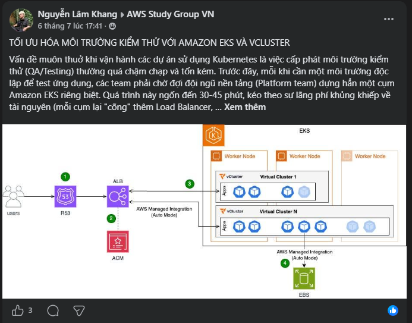

# OPTIMIZING TESTING ENVIRONMENTS WITH AMAZON EKS AND VCLUSTER

The eternal problem when operating projects using Kubernetes is that provisioning testing environments (QA/Testing) is often too slow and costly. Previously, whenever an independent environment was needed to test an application, teams had to wait for the Platform team to spin up an entirely separate Amazon EKS cluster. This process consumed up to 30-45 minutes, leading to a massive waste of resources (each cluster had to "carry" its own Load Balancer, DNS, and monitoring) and causing AWS infrastructure costs to skyrocket.
A radical solution to this problem has been successfully applied by Deloitte: Combining Amazon EKS (as the platform server) and vCluster to create ultra-lightweight virtual Kubernetes clusters running together on a single physical infrastructure.

Key takeaways:

* "Lightning-fast" deployment speed: The time to create a new testing environment is reduced from 45 minutes to under 5 minutes (89% faster). Developers and QA immediately have an independent workspace without needing to brew a coffee while waiting.
* Centralized operations, minimizing complexity: Instead of maintaining dozens of tools (like Ingress controllers, monitoring, etc.) scattered across dozens of different clusters, everything now uses a shared stack on the host cluster.
* Massive infrastructure cost reduction: Sharing core resources saves tens of vCPUs and hundreds of GBs of RAM. It can even save up to 70% in costs when flexibly combined with the EKS Auto Mode feature and running on EC2 Spot Instances.
* Empowering self-service: Development teams are no longer dependent. They can simply "press a button" to create their own virtual Kubernetes environments in minutes, completely freeing up the workload for the platform operations team.

[Link to Blog 2 Post](https://www.facebook.com/groups/awsstudygroupfcj/permalink/2205004010264559/)