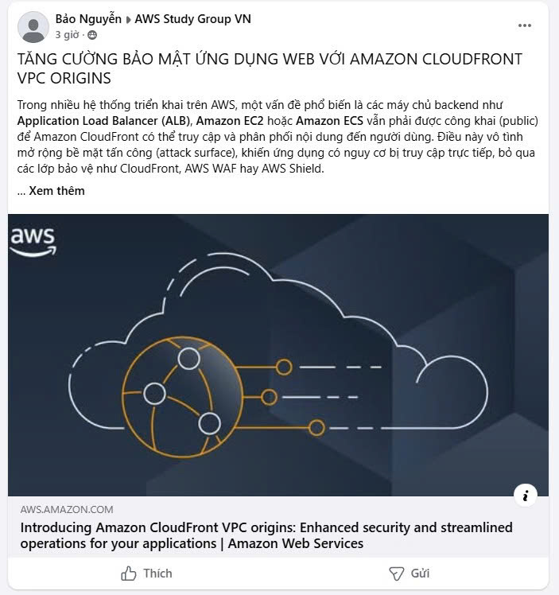

# TĂNG CƯỜNG BẢO MẬT ỨNG DỤNG WEB VỚI AMAZON CLOUDFRONT VPC ORIGINS

Trong nhiều hệ thống triển khai trên AWS, một vấn đề phổ biến là các máy chủ backend như Application Load Balancer (ALB), Amazon EC2 hoặc Amazon ECS vẫn phải được công khai (public) để Amazon CloudFront có thể truy cập và phân phối nội dung. Điều này vô tình mở rộng bề mặt tấn công, khiến ứng dụng có nguy cơ bị truy cập trực tiếp và bỏ qua các lớp bảo vệ bên ngoài. Để giải quyết vấn đề này, AWS đã giới thiệu Amazon CloudFront VPC Origins – giải pháp cho phép CloudFront kết nối trực tiếp tới các tài nguyên nằm trong private subnet của Amazon VPC. Nhờ đó, backend không còn cần địa chỉ IP công khai, trong khi người dùng vẫn tận dụng được sức mạnh từ mạng lưới CDN toàn cầu.

Các điểm chính cần nắm:

* **Bảo vệ backend khỏi Internet công cộng:** Việc đặt backend hoàn toàn trong mạng riêng (private subnet) và chỉ cho phép lưu lượng đi qua CloudFront giúp ngăn chặn hoàn toàn các truy cập trực tiếp từ người dùng. Điều này giảm đáng kể nguy cơ quét cổng (port scanning) và là bước tiến lớn trong việc xây dựng kiến trúc Zero Trust.
* **Duy trì hiệu năng phân phối tối ưu:** Mặc dù backend được ẩn đi, hệ thống vẫn tiếp tục sử dụng mạng lưới Edge Locations và backbone toàn cầu của AWS. Đảm bảo nội dung được phân phối với độ trễ thấp nhất mà không làm thay đổi trải nghiệm của người dùng cuối.
* **Đơn giản hóa kiến trúc hạ tầng:** Doanh nghiệp không còn phải loay hoay thiết lập NAT Gateway, proxy hay các giải pháp mạng rườm rà để che giấu backend. Mọi cấu hình kết nối private giờ đây được thực hiện trực tiếp và nhanh chóng ngay trên giao diện của CloudFront.
* **Tích hợp phòng thủ nhiều lớp (Defense in Depth):** Kết hợp hoàn hảo cùng AWS WAF (ngăn chặn tấn công web), AWS Shield (chống DDoS) và Security Groups. Tạo ra một hệ thống phòng thủ vững chắc, giải quyết triệt để bài toán bảo mật ứng dụng web toàn cầu.

[Đường Link dẫn đến bài Blog 3] *Chưa được duyệt bài.