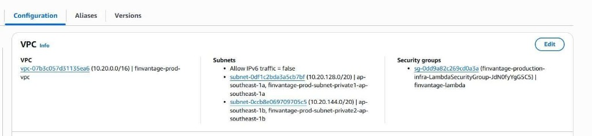
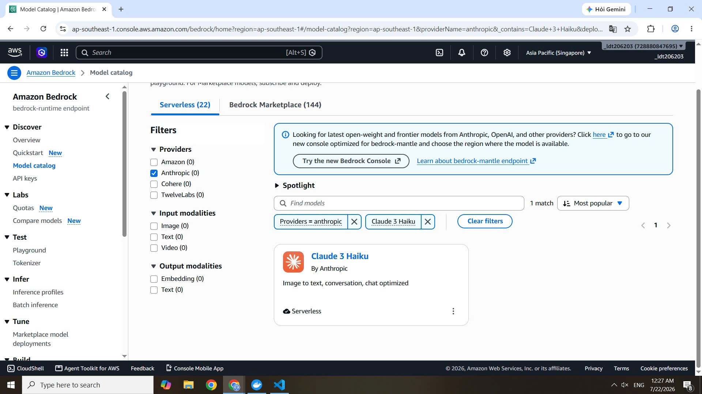

### Chuẩn bị Môi trường & Quyền hạn (Prerequisites)

Chào các bạn! Trước khi chúng ta bắt đầu dựng mạng hay viết code backend cho **FinVantage**, việc đầu tiên và cực kỳ quan trọng là chuẩn bị môi trường phát triển cục bộ và thiết lập các quyền truy cập AWS. 

Vì dự án thực tế của chúng ta sử dụng kiến trúc đặc biệt (Frontend chạy trên AWS Amplify, backend Lambda gọi Bedrock ở một tài khoản AWS khác thông qua vai trò liên tài khoản), việc cấu hình chuẩn xác ngay từ đầu sẽ giúp bạn tránh được hàng tá lỗi `AccessDenied` (từ chối truy cập) hoặc lỗi kết nối sau này.

---

### 1. Yêu cầu tài khoản AWS (AWS Account)

Để triển khai dự án FinVantage, chúng ta cần:
*   **Tài khoản Backend (Tài khoản hiện tại):** Nơi chúng ta sẽ deploy (triển khai) VPC, RDS PostgreSQL, ElastiCache Valkey, API Gateway và các hàm AWS Lambda.
*   **Tài khoản Bedrock (Tài khoản chéo):** Nơi đã được kích hoạt mô hình AI và chứa vai trò IAM Role `FinVantageBedrockInvokeRole` để chúng ta ủy quyền gọi mô hình chéo tài khoản.
*   **AWS Region chính:** Đảm bảo sử dụng khu vực Singapore (`ap-southeast-1`) cho tài khoản hiện tại để giảm thiểu độ trễ tối đa cho người dùng Việt Nam.

---



---

### 2. Kích hoạt Trí tuệ Nhân tạo (Amazon Bedrock Model Access)

Amazon Bedrock mặc định sẽ khóa toàn bộ mô hình ngôn ngữ. Vì dự án FinVantage sử dụng mô hình **Claude 3.5 Sonnet** (Model ID: `global.anthropic.claude-sonnet-4-6`), chúng ta phải xin quyền sử dụng:
1.  Truy cập vào AWS Console của tài khoản chứa Bedrock.
2.  Tìm kiếm dịch vụ **Amazon Bedrock** → Chọn **Model access** ở thanh menu bên trái.
3.  Chọn **Modify model access** → Tích chọn mô hình **Claude 3.5 Sonnet** (hoặc Claude 3 Haiku tùy phiên bản cấu hình).
4.  Nhấn **Save changes** và đợi trạng thái chuyển sang **Access granted** (màu xanh lá).

---

 



---

### 3. Công cụ cài đặt trên máy cá nhân (Local Tools)

Các bạn cần chuẩn bị đầy đủ các công cụ sau trên máy local (máy tính cá nhân) để viết code và deploy:

1.  **Node.js (phiên bản v20.x hoặc mới hơn):** Runtime (môi trường chạy mã) chính của backend Lambda và frontend React/Vite.
2.  **npm (đi kèm Node.js):** Trình quản lý thư viện Node.
3.  **AWS CLI (giao diện dòng lệnh AWS):** Dùng để cấu hình thông tin xác thực AWS local.
4.  **Serverless Framework (cài toàn cục qua npm):** Công cụ đóng gói và deploy hạ tầng serverless nhanh chóng.
5.  **Git:** Dùng để quản lý và đẩy code lên kho chứa (Repository).
6.  **VS Code:** Trình soạn thảo mã nguồn chính.

Các lệnh kiểm tra phiên bản sau khi cài đặt thành công:
```bash
# Kiểm tra Node.js và npm
node -v
npm -v

# Kiểm tra AWS CLI
aws --version

# Kiểm tra Serverless Framework
serverless -v
```

---

### 4. Đăng nhập AWS CLI an toàn

Để Serverless Framework có quyền deploy tài nguyên lên tài khoản AWS của bạn, chúng ta cần đăng nhập thông tin xác thực AWS CLI trên máy local:
1.  Tạo hoặc mở một Access Key (hoặc Session Token tạm thời) của IAM User có quyền Administrator trong AWS Console.
2.  Mở terminal và gõ lệnh: `aws configure`.
3.  Nhập các thông số Access Key ID, Secret Access Key, Region mặc định là `ap-southeast-1`.
4.  Chạy lệnh sau để kiểm tra xem AWS CLI đã nhận diện đúng tài khoản chưa:
    ```bash
    aws sts get-caller-identity
    ```


### 5. Chuẩn bị mã nguồn (Source Code)

Các bước khởi tạo dự án:
1.  Clone (sao chép) repository chứa dự án FinVantage từ GitHub về máy.
2.  Truy cập vào thư mục backend và chạy lệnh: `npm install` để cài đặt toàn bộ dependencies (thư viện phụ thuộc).
3.  Copy file `.env.example` thành file `.env` và cấu hình các biến môi trường thực tế (Redis URL, DB credentials, Bedrock Role ARN...).

> ⚠️ **Lưu ý bảo mật:** Tuyệt đối không bao giờ được commit (lưu trữ) tệp tin `.env` chứa mật khẩu thật, secrets hoặc thư mục `.serverless/`, `node_modules/` lên GitHub để tránh lộ thông tin bảo mật của dự án.

---

### 6. Kiểm tra cấu hình trước khi deploy

Trước khi bắt tay vào cấu hình tài nguyên AWS ở các chương sau, hãy chắc chắn rằng:
*   Biến `BEDROCK_ROLE_ARN` trong file `.env` đã trỏ đúng đến ARN của role `FinVantageBedrockInvokeRole`.
*   Biến `AWS_REGION` được set là `ap-southeast-1`.
*   Trạng thái `USE_MOCK_AI` trong môi trường local đã được tắt (set bằng `false`) nếu bạn muốn test gọi trực tiếp Bedrock thật trên Cloud.

Chúng ta đã chuẩn bị sẵn sàng, hãy bước sang phần cấu hình mạng VPC ở chương tiếp theo!