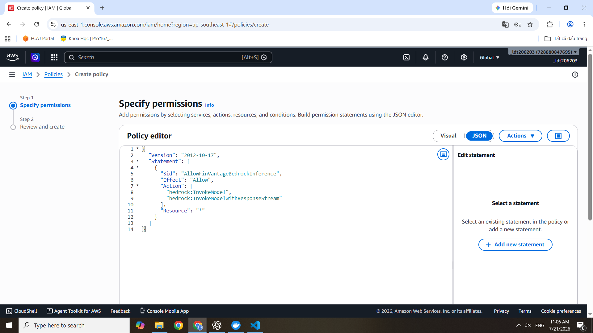

### Chuẩn bị Môi trường & Quyền hạn (Prerequisites)

Trước khi bắt tay vào xây dựng kiến trúc mạng và viết code cho FinVantage, chúng ta cần thiết lập nền tảng môi trường và cấu hình các quyền bảo mật khắt khe (Identity and Access Management - IAM) theo nguyên tắc **Đặc quyền tối thiểu (Least Privilege)**. 

#### 1. Môi trường AWS (AWS Environment)
*   **Region:** Đảm bảo toàn bộ tài nguyên (VPC, Lambda, Bedrock...) được triển khai trên cùng một Region (Ví dụ: `us-east-1` hoặc `ap-southeast-1`) để tối ưu hóa độ trễ và tránh phí truyền tải dữ liệu chéo khu vực (Cross-region data transfer).

#### 2. Kích hoạt Trí tuệ Nhân tạo (Amazon Bedrock Model Access)
Amazon Bedrock không tự động mở khóa các mô hình ngôn ngữ lớn (LLM). Để hàm `Analysis Lambda` có thể gọi AI phân tích thói quen chi tiêu, bạn cần xin cấp quyền sử dụng mô hình (ví dụ: Anthropic Claude 3 hoặc Amazon Titan).
*   Truy cập vào giao diện **Amazon Bedrock** > **Model access**.
*   Gửi yêu cầu cấp quyền (Request model access) cho mô hình bạn chọn và đợi AWS phê duyệt (thường mất vài phút).

> 📸 **[NHẮC NHỞ CHÈN ẢNH]:** Bạn hãy chụp màn hình giao diện **Model access** trong Amazon Bedrock, hiển thị trạng thái "Access granted" (Màu xanh lá) của mô hình AI mà bạn đã xin quyền.
> *Mã Markdown:* ``

#### 3. Thiết lập IAM Roles cho Kiến trúc Serverless
Trong kiến trúc Serverless, AWS Lambda không tự nhiên có quyền truy cập vào RDS hay S3. Chúng ta cần tạo các IAM Role cụ thể:
*   **Core-Lambda-Role:** Dành cho các hàm xử lý logic (`Payment Lambda`, `Worker Lambda`). Role này cần policy `AWSLambdaVPCAccessExecutionRole` để Lambda có thể chui vào Private Subnet giao tiếp với RDS và ElastiCache, cộng thêm quyền đọc/ghi message vào Amazon SQS.
*   **AI-Processing-Role:** Dành cho `Import Lambda` và `Parse & Categorize Lambda`. Ngoài quyền vào VPC, Role này phải được gắn policy `AmazonTextractFullAccess`, quyền đọc ghi file ở S3 (`s3:PutObject`, `s3:GetObject`) và quyền gọi API của Bedrock (`bedrock:InvokeModel`).

> *Mã Markdown:* 