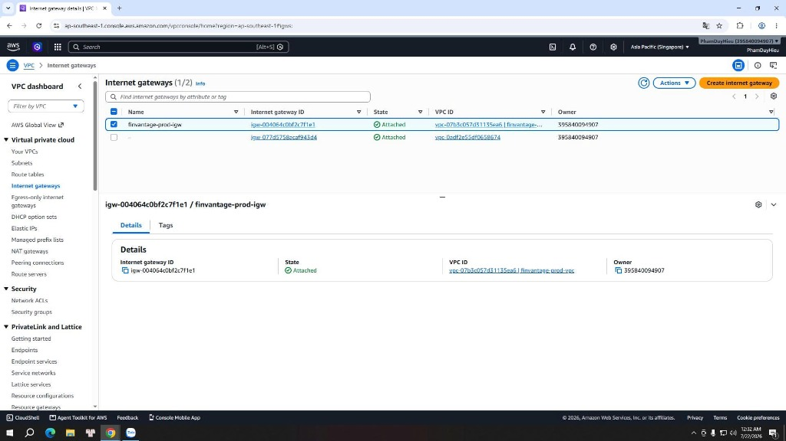

### Tạo hoặc kiểm tra VPC và Internet Gateway

### Mục tiêu
Trang này sẽ hướng dẫn bạn cách truy cập vào VPC Console (giao diện quản lý mạng VPC) trên AWS để xác minh cấu hình của mạng ảo riêng tư và Internet Gateway (cổng kết nối Internet) đã được khởi tạo cho hệ thống **FinVantage**.

### Giới thiệu ngắn
Để xây dựng một hệ thống hoạt động ổn định và bảo mật trên môi trường đám mây AWS, việc đầu tiên chúng ta cần làm là xác nhận hệ thống mạng ảo riêng tư VPC đã hoạt động chính xác. FinVantage sử dụng một dải địa chỉ IP riêng biệt để phân tách môi trường, tránh xung đột với các hệ thống khác.

### Vai trò của dịch vụ trong FinVantage
*   **Amazon VPC:** Đóng vai trò làm ranh giới an toàn bao bọc toàn bộ backend Lambda, database PostgreSQL và Valkey cache. Mọi kết nối truy cập từ ngoài vào cơ sở dữ liệu sẽ bị chặn đứng nhờ bức tường mạng này.
*   **Internet Gateway (IGW):** Đóng vai trò làm cửa ngõ định tuyến cho các tài nguyên ở Public Subnets (phân đoạn mạng công khai) truy cập ra ngoài Internet (ví dụ như để NAT Gateway tải dữ liệu, hoặc cập nhật thư viện từ bên ngoài).

---

### Các bước kiểm tra cấu hình trên AWS Console

> ⚠️ **Lưu ý:** Dự án FinVantage production của bạn đã được khởi tạo tài nguyên mạng sẵn. Bạn chủ yếu thực hiện các bước kiểm tra thông số và chụp ảnh cấu hình để phục vụ báo cáo.

Hãy thực hiện các bước sau để kiểm tra:

**Bước 1:** Đăng nhập vào AWS Console, tại ô tìm kiếm nhập `VPC` và chọn dịch vụ **VPC**. Đảm bảo khu vực (Region) đang chọn ở góc trên bên phải là **Singapore (`ap-southeast-1`)**.

**Bước 2:** Tại thanh menu bên trái, click chọn **Your VPCs**. 
*   Tìm kiếm VPC có tên dự án FinVantage (thường có tag Name là `FinVantage-VPC` hoặc `finvantage-prod-vpc`).
*   Xác minh cột **State** hiển thị trạng thái `Available` (Khả dụng).
*   Ghi nhận thông số **IPv4 CIDR block**: `10.20.0.0/16` (VPC `finvantage-prod-vpc`).

---

**Bước 3:** Tích chọn VPC của FinVantage và nhìn xuống tab **Details** ở phía dưới:
*   Đảm bảo trường **DNS resolution** hiển thị trạng thái `Enabled`.
*   Đảm bảo trường **DNS hostnames** hiển thị trạng thái `Enabled`. 
*   *Lưu ý:* Việc bật hai tính năng DNS này giúp các dịch vụ AWS trong VPC có thể phân giải tên miền (DNS resolution) nội bộ một cách chính xác.

**Bước 4:** Tại thanh menu bên trái, click chọn **Internet gateways**:
*   Tìm kiếm Internet Gateway liên kết với VPC của bạn (thường có tên dạng `FinVantage-IGW` hoặc `finvantage-prod-igw`).
*   Xác minh trạng thái cột **State** hiển thị `Attached` (Đã gắn kết).
*   Đảm bảo cột **VPC ID** hiển thị chính xác ID của VPC FinVantage vừa kiểm tra ở Bước 2.

---

---

### Cách kết nối với các dịch vụ khác
Internet Gateway sau khi được gắn (Attach) vào VPC sẽ chưa tự hoạt động định tuyến. Ở các bài tiếp theo, chúng ta phải liên kết nó vào bảng định tuyến (Route Table) của Public Subnets để cho phép lưu lượng mạng từ các phân đoạn mạng này truyền ra ngoài Internet.

### Các lỗi thường gặp và cách xử lý
*   **Lỗi: `DNS resolution fails inside VPC`**
    *   *Nguyên nhân:* Do DNS resolution hoặc DNS hostnames chưa được bật (`Disabled`) trong thuộc tính VPC.
    *   *Cách xử lý:* Vào **Your VPCs** → Chọn VPC FinVantage → Click nút **Actions** → Chọn **Edit VPC settings** → Tích chọn bật **Enable DNS hostnames** và **Enable DNS resolution** → Nhấn **Save**.

### Kết luận ngắn
VPC và Internet Gateway đã hoạt động ổn định, tạo nền tảng vững chắc để chúng ta tiến hành chia nhỏ các phân đoạn mạng (Subnets) ở bài học tiếp theo.
