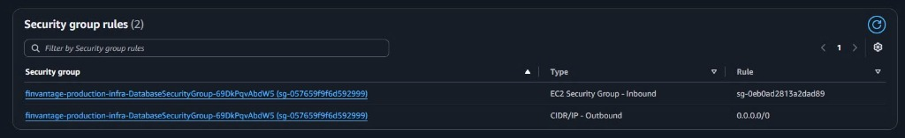

### 1. Cấu hình Bảng định tuyến (Route Tables)
Định tuyến giống như biển báo giao thông, chỉ đường cho dữ liệu đi đúng hướng.
*   **Public Route Table:** Gắn vào 2 Public Subnets. Thêm Rule: Định tuyến `0.0.0.0/0` (tất cả traffic ra Internet) trỏ Target về **Internet Gateway (IGW)**.
*   **Private Route Table:** Gắn vào 2 Private Subnets. Thêm Rule: Định tuyến `0.0.0.0/0` trỏ Target về **NAT Gateway**. Nhờ rule này, Lambda mới có thể âm thầm gọi API AI từ mạng nội bộ.

> 📸 **[NHẮC NHỞ CHÈN ẢNH]:** Chụp màn hình giao diện Route Table của Private Subnet, cho thấy traffic đi ra ngoài được hướng qua `nat-...`.
> *Mã Markdown:* ``

### 2. Thiết lập Security Groups (Tường lửa)
Thay vì chặn IP truyền thống, kiến trúc Cloud cho phép chặn theo nhóm bảo mật (Security Group - SG).
*   **Tạo Lambda-SG:** Gắn cho các hàm Lambda. Inbound để trống (không nhận kết nối vào). Outbound cho phép tất cả để gọi ra ngoài.
*   **Tạo Database-SG:** Gắn cho RDS và ElastiCache. Inbound chỉ mở cổng `3306` (MySQL) và `6379` (Redis). Điểm mấu chốt: **Cột Source không điền IP, mà điền ID của Lambda-SG**.

Cấu hình này đảm bảo nguyên tắc: Chỉ những hàm Lambda được cấp phép mới có quyền gõ cửa Database, chặn đứng mọi rủi ro dò quét hệ thống từ các nguồn bên ngoài.

---

