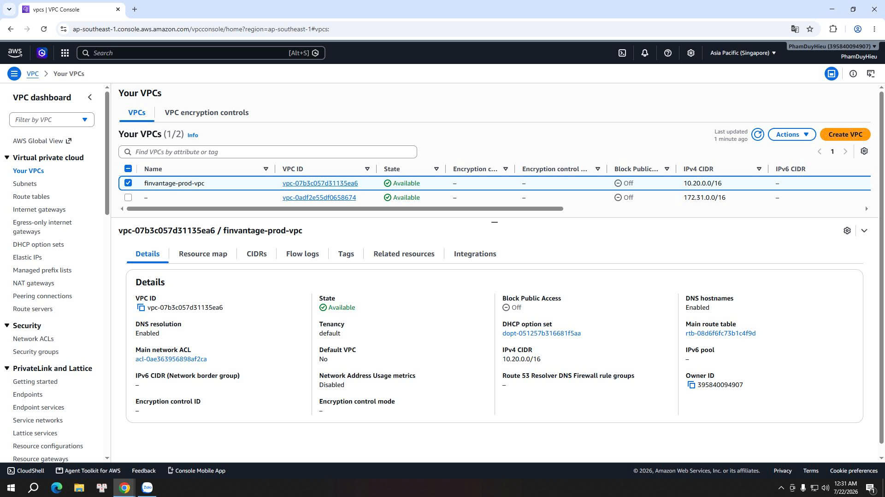

### Cấu hình Mạng và Bảo mật (VPC Networking)

Chào các bạn! Trong chương này, chúng ta sẽ cùng nhau tìm hiểu và thiết lập "bức tường bảo vệ" đầu tiên cho toàn bộ hệ thống FinVantage – đó chính là hạ tầng mạng **Amazon VPC (Virtual Private Cloud)**.

Đối với một ứng dụng quản lý tài chính cá nhân, việc bảo vệ dữ liệu giao dịch và thông tin ngân sách của người dùng là ưu tiên hàng đầu. Một lỗ hổng nhỏ trong cấu hình mạng có thể dẫn đến việc cơ sở dữ liệu bị tấn công từ bên ngoài. Do đó, việc xây dựng một isolated network (hệ thống mạng cô lập, bảo mật) là bước đi không thể thiếu.

---

### Vì sao FinVantage cần VPC riêng?

1.  **Cô lập tài nguyên nhạy cảm:** Chúng ta không thể đặt cơ sở dữ liệu PostgreSQL hay cụm cache Valkey trực tiếp trên Internet. Bằng cách sử dụng VPC, chúng ta có thể đưa chúng vào các private subnet (phân đoạn mạng riêng tư) – nơi hoàn toàn không có đường truyền trực tiếp từ Internet đi vào.
2.  **Quản lý luồng dữ liệu chặt chẽ:** Chỉ cho phép các API request (lời gọi API) hợp lệ đi qua API Gateway và chạy qua các hàm AWS Lambda được cấu hình an toàn để truy vấn cơ sở dữ liệu.
3.  **Nguyên tắc đặc quyền tối thiểu (Least Privilege):** Bằng cách kết hợp Subnets, Route Tables (bảng định tuyến) và Security Groups (nhóm bảo mật), chúng ta kiểm soát chính xác thiết bị nào, dịch vụ nào được phép nói chuyện với nhau.

---

### Vì sao Lambda cần được gắn vào VPC?

Mặc dù Lambda là một dịch vụ phi máy chủ hoạt động độc lập, nhưng để nó có thể truy vấn dữ liệu từ PostgreSQL hay đọc/ghi session từ Valkey nằm sâu trong private subnet, chúng ta bắt buộc phải gắn Lambda vào cùng một VPC. Khi gắn VPC, AWS sẽ cấp cho Lambda các ENI (Elastic Network Interface - giao diện mạng ảo) để Lambda có thể giao tiếp nội bộ một cách an toàn.

---

   

---

### Lộ trình thiết lập mạng trong chương này:

Để dựng được một mạng lưới an toàn và hoạt động trơn tru cho FinVantage, chúng ta sẽ lần lượt thực hành qua 3 bài viết chi tiết:

1.  **Bài 5.3.1. Tạo hoặc kiểm tra VPC:** Khởi tạo VPC gốc và cấu hình Internet Gateway để tiếp nhận traffic biên.
2.  **Bài 5.3.2. Cấu hình Subnets & NAT Gateway:** Tạo các public subnet và private subnet chia đều trên 2 Availability Zone (vùng khả dụng) khác nhau để đạt tính sẵn sàng cao (High Availability).
3.  **Bài 5.3.3. Định tuyến & Security Groups:** Cấu hình Route Tables định tuyến dữ liệu ra ngoài và thiết lập các nhóm tường lửa Security Groups cho Lambda, RDS Proxy và Valkey.

Hãy cùng bắt đầu với bước khởi tạo VPC ở trang tiếp theo!