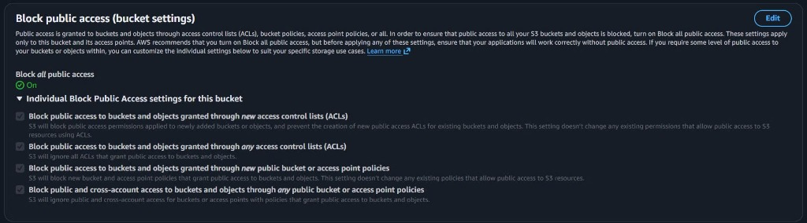
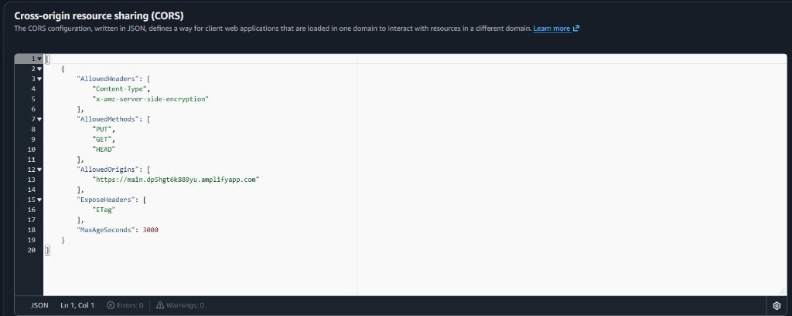
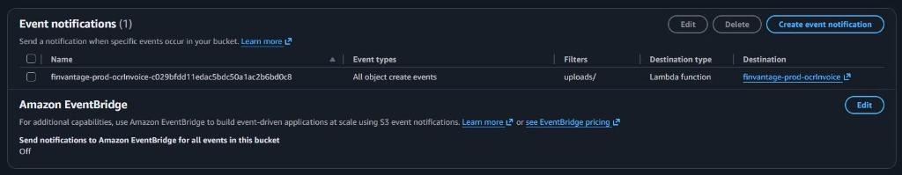
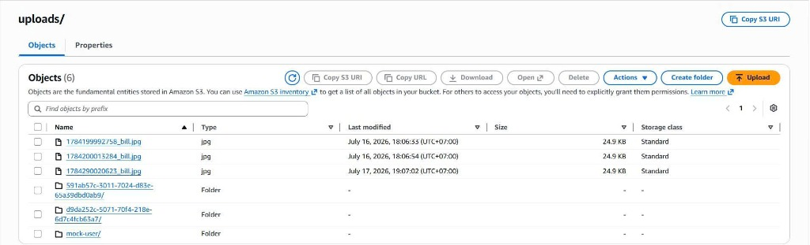

---
title: "Amazon S3 lưu hóa đơn"
date: 2026-07-20
weight: 1
chapter: false
pre: " <b> 5.4.1. </b> "
---

### Amazon S3 lưu hóa đơn

### Mục tiêu
Trang này sẽ hướng dẫn các bạn cách truy cập giao diện quản lý **Amazon S3** trên AWS Console để kiểm tra các thiết lập bảo mật riêng tư, cấu hình CORS rules (quy tắc chia sẻ tài nguyên nguồn gốc chéo), bộ kích hoạt sự kiện event notifications (thông báo kích hoạt sự kiện) Lambda, và xác minh thư mục lưu trữ hóa đơn thực tế của hệ thống **FinVantage**.

### Giới thiệu ngắn
Amazon S3 là dịch vụ lưu trữ đối tượng vô cùng bền bỉ và bảo mật cao. Đối với FinVantage, đây là nơi đầu tiên tiếp nhận các file ảnh hoặc PDF hóa đơn gốc do người dùng tải lên từ giao diện Web.

### Vai trò của dịch vụ trong FinVantage
*   **Lưu trữ file thô:** Chứa các file hóa đơn gốc được tải lên an toàn. Bucket này được cấu hình chặn toàn bộ truy cập công cộng để bảo vệ dữ liệu cá nhân.
*   **Cơ chế Presigned URL (đường dẫn ký trước):** Giúp Frontend của bạn có thể upload file trực tiếp lên S3 mà không cần đi xuyên qua Lambda backend (tránh quá tải bộ nhớ Lambda) và không cần mở công khai S3 bucket. Đường dẫn này do Lambda `finvantage-prod-importInvoice` tạo ra với thời gian hết hạn cực ngắn (ví dụ: vài phút).
*   **Trigger kích hoạt OCR:** Khi có tệp tin mới ghi nhận tại prefix (thư mục) `uploads/`, S3 sẽ tự động phát tín hiệu kích hoạt hàm Lambda `finvantage-prod-ocrInvoice` xử lý bóc tách chữ.

---

### Các bước kiểm tra cấu hình trên AWS Console

#### 1. Kiểm tra thuộc tính bảo mật S3

**Bước 1:** Đăng nhập AWS Console → Nhập `S3` vào ô tìm kiếm → Chọn dịch vụ **S3**.

**Bước 2:** Tìm và click chọn tên bucket thực tế của dự án: `finvantage-invoices-hieu-2026-395840094907`.

**Bước 3:** Vào tab **Permissions**:
*   Xác minh mục **Block public access (bucket settings)** hiển thị trạng thái `Block *all* public access` ở chế độ **On** (Bật).

---



---

**Bước 4:** Chuyển sang tab **Properties**:
*   Cuộn xuống mục **Default encryption** (Mã hóa mặc định). Xác minh trạng thái hiển thị là `Enabled` (Đã bật) với chuẩn mã hóa Amazon S3 managed keys (SSE-S3) để bảo vệ data at rest (dữ liệu ở trạng thái nghỉ).

#### 2. Kiểm tra cấu hình CORS (Cross-Origin Resource Sharing)

**Bước 1:** Vẫn ở tab **Permissions**, cuộn xuống dưới cùng tìm mục **Cross-origin resource sharing (CORS)**.

**Bước 2:** Xác minh đoạn cấu hình JSON thực tế đang cho phép Frontend giao tiếp:
```json
[
    {
        "AllowedHeaders": [
            "Content-Type",
            "x-amz-server-side-encryption"
        ],
        "AllowedMethods": [
            "PUT",
            "GET",
            "HEAD"
        ],
        "AllowedOrigins": [
            "https://main.dp5hgt6k889yu.amplifyapp.com"
        ],
        "ExposeHeaders": [
            "ETag"
        ]
    }
]
```
*Giải thích:* Cấu hình này chỉ cho phép domain Frontend Amplify gửi các request PUT (upload), GET (tải về), HEAD lên S3 Bucket kèm theo header mã hóa an toàn.

---



---

#### 3. Kiểm tra bộ kích hoạt sự kiện Event Notification

**Bước 1:** Chuyển sang tab **Properties**, cuộn xuống mục **Event notifications**.

**Bước 2:** Xác minh có dòng cấu hình sự kiện:
*   **Event types:** `s3:ObjectCreated:*` (Kích hoạt khi có tệp mới được tạo).
*   **Prefix:** `uploads/` (Chỉ kích hoạt khi tệp nằm trong thư mục uploads).
*   **Destination (Đích đến):** Trỏ về hàm Lambda `finvantage-prod-ocrInvoice`.

---



---

#### 4. Xem thư mục uploads/ và tệp tin thực tế

**Bước 1:** Chuyển sang tab **Objects**.

**Bước 2:** Click vào thư mục `uploads/` để kiểm tra danh sách các ảnh hóa đơn thực tế đã được upload thành công từ client.

---



---

### Kết luận ngắn
Amazon S3 lưu trữ hóa đơn đã được cấu hình bảo mật đúng chuẩn, tích hợp thành công CORS và Event Notification để sẵn sàng tự động hóa luồng bóc tách dữ liệu.
