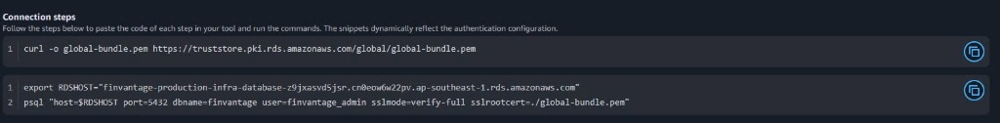

### Amazon RDS PostgreSQL

### Mục tiêu
Trang này sẽ hướng dẫn các bạn cách truy cập **Amazon RDS Console** trên AWS để xác minh cấu hình của cơ sở dữ liệu quan hệ **Amazon RDS PostgreSQL** (bao gồm trạng thái hoạt động, cổng kết nối, bảo vệ chống xóa, mã hóa dữ liệu và chế độ bảo mật nội bộ) của hệ thống **FinVantage**.

### Giới thiệu ngắn
Cơ sở dữ liệu quan hệ là nơi lưu trữ toàn bộ dữ liệu tài chính có cấu trúc chặt chẽ của người dùng. Để bảo mật tuyệt đối, database engine (động cơ cơ sở dữ liệu) PostgreSQL được cấu hình ẩn hoàn toàn khỏi Internet, mã hóa dữ liệu tĩnh và chỉ tiếp nhận kết nối nội bộ từ trong mạng VPC.

### Vai trò của dịch vụ trong FinVantage
*   **Lưu trữ dữ liệu cốt lõi:** Lưu trữ thông tin tài khoản người dùng, chi tiết các hóa đơn đã được phân tích, lịch sử giao dịch chi tiêu, hạn mức ngân sách và các tư vấn tài chính từ AI.
*   **DB Subnet Group (nhóm phân đoạn mạng cơ sở dữ liệu):** Gom các private subnet đa vùng khả dụng lại để làm nơi khởi tạo database.
*   **Deletion protection (bảo vệ chống xóa):** Cơ chế an toàn ngăn chặn việc vô tình xóa nhầm database trên AWS Console gây mất mát dữ liệu.
*   **Encryption (mã hóa dữ liệu):** Mã hóa toàn bộ dữ liệu ghi nhận dưới ổ đĩa cứng vật lý (data at rest) bằng AWS KMS key để đảm bảo ngay cả khi ổ cứng vật lý bị đánh cắp, dữ liệu cũng không thể bị đọc trộm.

---

### Các bước kiểm tra cấu hình trên AWS Console

#### 1. Kiểm tra DB Subnet Group

**Bước 1:** Đăng nhập AWS Console → Tìm kiếm `RDS` → Chọn dịch vụ **RDS**.

**Bước 2:** Tại menu bên trái, click chọn **Subnet groups**.

**Bước 3:** Click chọn subnet group của FinVantage (thường có tên dạng `finvantage-db-subnet-group`). 
*   Xác minh xem group có liên kết đúng với VPC của dự án hay không.
*   Đảm bảo group chứa ít nhất 2 Private Subnets thuộc 2 Availability Zones khác nhau (`ap-southeast-1a` và `ap-southeast-1b`) để đảm bảo tính dự phòng cao.

#### 2. Kiểm tra Database Instance

**Bước 1:** Tại menu bên trái của RDS Console, click chọn **Databases**.

**Bước 2:** Click chọn tên cơ sở dữ liệu PostgreSQL của dự án FinVantage (thường có tag Name là `finvantage-prod-db` hoặc tương đương).

**Bước 3:** Tại tab **Connectivity & security** (Kết nối & bảo mật), xác minh các thông số:
*   **Status:** Trạng thái hiển thị là `Available` (Sẵn sàng hoạt động).
*   **Endpoint:** Ghi nhận địa chỉ endpoint kết nối của database: `<LẤY GIÁ TRỊ THỰC TẾ TỪ AWS CONSOLE>`.
*   **Port:** Cổng kết nối hiển thị chính xác là `5432` (cổng mặc định của PostgreSQL).
*   **Publicly accessible:** Trạng thái hiển thị là **No** (Không mở công khai ra Internet).
*   **Security groups:** Liên kết đúng với nhóm bảo mật `Database-SG`.

---

---

**Bước 4:** Chuyển sang tab **Configuration** (Cấu hình) để kiểm tra độ tin cậy của hạ tầng:
*   **Engine:** Xác nhận là `PostgreSQL`.
*   **Deletion protection:** Hiển thị trạng thái là `Enabled` (Đã bật).
*   **Encryption:** Trường Encryption hiển thị trạng thái `Enabled` (Đã bật mã hóa dữ liệu tĩnh).

---

> 📸 HÌNH CẦN THÊM  
> Chụp màn hình: AWS Console → RDS → Databases → click chọn database của FinVantage → tab Configuration.  
> Nội dung cần thấy: Engine PostgreSQL, thông số Deletion protection hiển thị Enabled, và thông số Encryption hiển thị Enabled.  
> Tên ảnh đề xuất: `finvantage-rds-configuration.png`  
> Chú thích: “Hình 5.4.2b. Cấu hình chi tiết bảo vệ dữ liệu (Deletion Protection & Encryption) của RDS PostgreSQL.”

---

**Bước 5:** Chuyển sang tab **Maintenance & backups** (Bảo trì & sao lưu):
*   Xác minh cấu hình **Backups** tự động đang được bật và có thời gian lưu trữ tối thiểu 7 ngày.

> ⚠️ **Lưu ý bảo mật:** Tuyệt đối không bao giờ chụp màn hình hoặc ghi lại mật khẩu database (master password) hay thông tin đăng nhập trong các tài liệu hoặc chia sẻ qua các kênh chat công cộng.

### Kết nối với các dịch vụ khác
Hàm Lambda backend của FinVantage sẽ không kết nối trực tiếp đến Endpoint của RDS PostgreSQL này. Thay vào đó, để tối ưu hóa tài nguyên kết nối, Lambda sẽ kết nối thông qua **RDS Proxy** (chúng ta sẽ kiểm tra ở bài viết tiếp theo).

### Các lỗi thường gặp và cách xử lý
*   **Lỗi: `Connection timeout to PostgreSQL`**
    *   *Nguyên nhân:* Nhóm bảo mật `Database-SG` chưa mở cổng `5432` cho `Lambda-SG` (hoặc `RDS-Proxy-SG`), hoặc database vô tình bị gắn sai Subnet group.
    *   *Cách xử lý:* Kiểm tra lại Inbound rules của `Database-SG` trong VPC, đảm bảo cho phép cổng `5432` từ nguồn là ID của `Lambda-SG`.

### Kết luận ngắn
Database PostgreSQL đã được thiết lập bảo mật an toàn, mã hóa dữ liệu tĩnh đầy đủ và sẵn sàng kết nối bảo mật qua RDS Proxy.

---

### Danh sách hình ảnh cần chụp cho báo cáo
1.  `finvantage-rds-connectivity.png` - Endpoint, cổng kết nối 5432 và bảo mật kết nối.
2.  `finvantage-rds-configuration.png` - Trạng thái cấu hình PostgreSQL, Encryption và Deletion Protection.