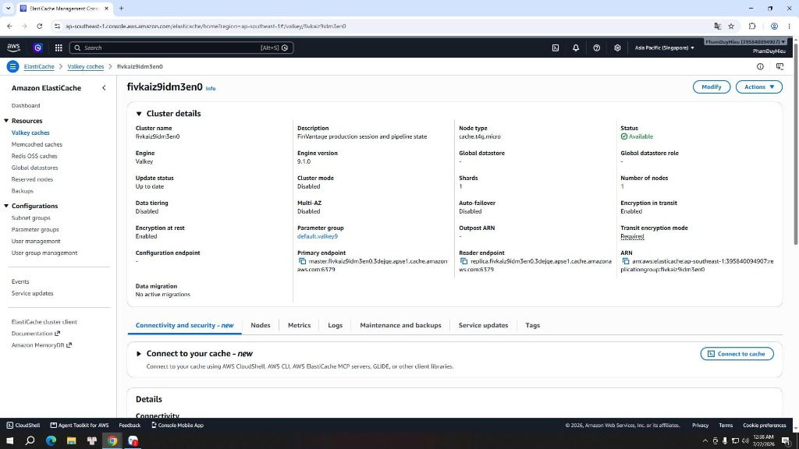

### ElastiCache Valkey/Redis

### Mục tiêu
Trang này sẽ hướng dẫn các bạn cách truy cập **Amazon ElastiCache Console** trên AWS để kiểm tra và xác minh trạng thái hoạt động của cụm bộ nhớ đệm **Amazon ElastiCache Valkey/Redis** (bao gồm địa chỉ primary endpoint, cổng kết nối, cơ chế mã hóa và nhóm mạng riêng tư liên kết) của hệ thống **FinVantage**.

### Giới thiệu ngắn
Amazon ElastiCache cung cấp một in-memory cache (bộ nhớ đệm trên bộ nhớ trong) với tốc độ phản hồi cực nhanh (độ trễ dưới mili-giây). Dự án FinVantage sử dụng dịch vụ này làm phân lớp lưu trữ tạm thời trung gian để đồng bộ hóa trạng thái xử lý hóa đơn và quản lý phiên làm việc của người dùng.

### Vai trò của Valkey/Redis trong dự án FinVantage
Thay vì chỉ lưu cache kết quả database thông thường, Valkey/Redis đóng vai trò là "trạm điều phối trạng thái" cho toàn bộ pipeline xử lý hóa đơn:
1.  **Auth session (phiên làm việc):** Lưu trữ thông tin session hoạt động của người dùng sau khi xác thực thành công qua Cognito.
2.  **Trạng thái upload:** Theo dõi trạng thái tệp tin hóa đơn bắt đầu được đẩy lên S3 (`UPLOADED`).
3.  **Kết quả OCR:** Lưu trữ dữ liệu văn bản thô bóc tách được từ Amazon Textract (`OCR_PROCESSING` -> `OCR_COMPLETED`). Nhờ đó, Lambda phân tích AI chỉ cần đọc trực tiếp text từ Redis mà không cần gọi lại Textract, giúp tiết kiệm chi phí và tăng tốc độ xử lý.
4.  **Trạng thái analysis:** Cập nhật trạng thái phân tích AI của hóa đơn (`ANALYZING` -> `ANALYZED`).

---

### Các bước kiểm tra cấu hình trên AWS Console

**Bước 1:** Đăng nhập AWS Console → Tìm kiếm `ElastiCache` → Chọn dịch vụ **ElastiCache**.

**Bước 2:** Tại menu bên trái, click chọn **Redis OSS** hoặc **Valkey** clusters (tùy theo động cơ dữ liệu thực tế đang dùng).

**Bước 3:** Click chọn tên cụm cluster của dự án FinVantage (thường có tag Name là `finvantage-prod-redis` hoặc tương đương).

**Bước 4:** Tại trang thông tin chi tiết cụm cluster, xác minh các thông số kỹ thuật:
*   **Status:** Trạng thái hoạt động hiển thị là `Available` hoặc `Active`.
*   **Primary endpoint (địa chỉ kết nối chính):** Ghi nhận địa chỉ kết nối chính của cụm: `<LẤY GIÁ TRỊ THỰC TẾ TỪ AWS CONSOLE>`.
*   **Port:** Cổng kết nối hiển thị chính xác là `6379` (cổng mặc định của Redis/Valkey).
*   **Subnet group:** Liên kết đúng với nhóm Subnet nằm trong VPC Private Subnets của dự án.
*   **Security groups:** Đảm bảo được gắn nhóm bảo mật `Valkey-SG` (hoặc `Database-SG`).
*   **Encryption in transit (Mã hóa đường truyền):** Trạng thái hiển thị là `Enabled` (Đã bật) để mã hóa toàn bộ dữ liệu truyền tải giữa Lambda và cụm cache.

---

---

> ⚠️ **Lưu ý bảo mật:** Tuyệt đối không chụp màn hình hay hiển thị auth token (mã thông báo xác thực) đăng nhập của Redis/Valkey trong báo cáo để tránh bị khai thác tài nguyên trái phép.

### Cách kết nối với các dịch vụ khác
Hàm Lambda Backend sẽ đọc biến môi trường `REDIS_URL` (có định dạng `redis://<endpoint>:6379` hoặc `rediss://...` nếu có bật TLS) để khởi tạo kết nối thông qua thư viện Redis của Node.js.

### Các lỗi thường gặp và cách xử lý
*   **Lỗi: `Redis connection timeout / Network unreachable`**
    *   *Nguyên nhân:* Nhóm bảo mật `Valkey-SG` chưa mở cổng inbound `6379` cho `Lambda-SG`, hoặc do Lambda chạy ngoài VPC nên không thể kết nối vào Private Subnet của ElastiCache.
    *   *Cách xử lý:* Kiểm tra lại cấu hình Security Group của Valkey, đảm bảo cho phép Inbound cổng `6379` từ nguồn `Lambda-SG`.

### Kết luận ngắn
Cụm Valkey/Redis đã hoạt động ổn định, sẵn sàng cung cấp lớp đệm lưu trữ trạng thái tốc độ cao cho toàn bộ luồng xử lý hóa đơn tự động.

---

### Danh sách hình ảnh cần chụp cho báo cáo
1.  `finvantage-elasticache.png` - Chi tiết cụm ElastiCache Valkey/Redis, Endpoint và Port.