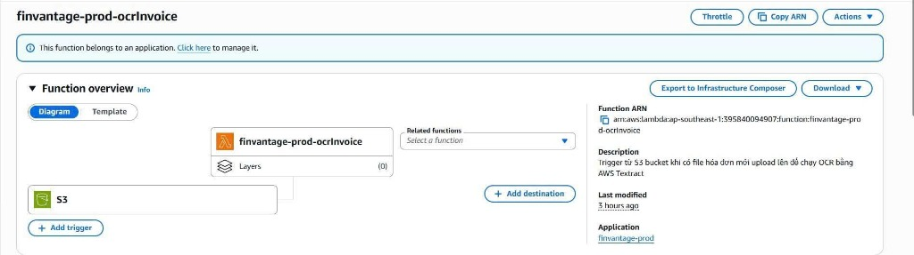
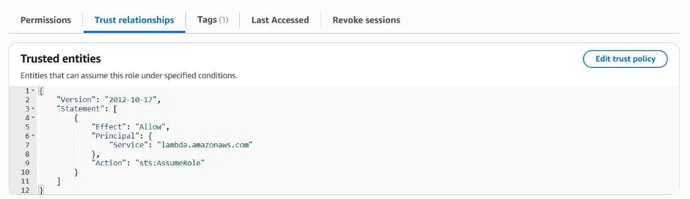
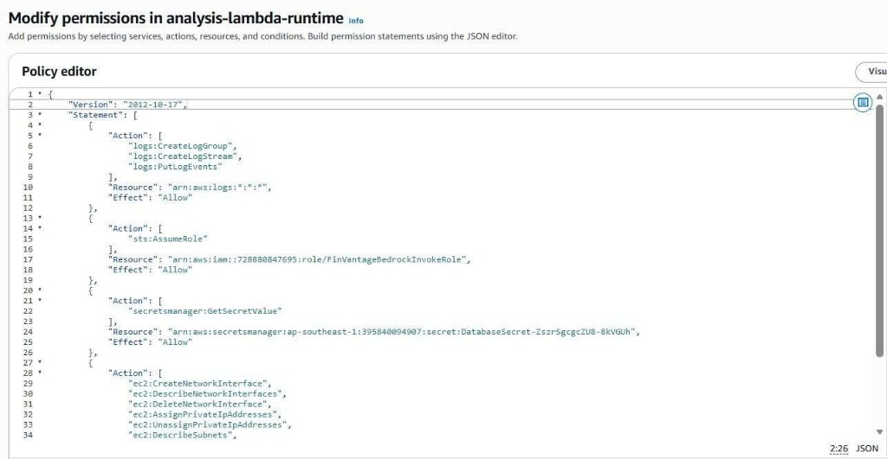

---
title: "Tích hợp AI (Textract & Bedrock)"
date: 2026-07-20
weight: 3
chapter: false
pre: " <b> 5.5.3. </b> "
---

### Tích hợp AI (Textract & Bedrock)

### Mục tiêu
Trang này sẽ hướng dẫn các bạn cách kiểm tra và cấu hình bộ kích hoạt S3 trigger của hàm OCR Lambda, cách Textract gọi API `AnalyzeExpense` để trích xuất hóa đơn, và đặc biệt là cách thiết lập cấu hình bảo mật liên tài khoản **Bedrock cross-account IAM role** (vai trò liên tài khoản) thông qua cơ chế `sts:AssumeRole` (ủy quyền vai trò) của hệ thống **FinVantage**.

### Giới thiệu ngắn
Đây là phân hệ cốt lõi tạo nên sự thông minh của FinVantage. Hệ thống kết hợp hai dịch vụ AI chuyên sâu của AWS: Amazon Textract để bóc tách text thô và Amazon Bedrock (mô hình Claude 3.5 Sonnet) để phân loại chi tiêu và đưa ra lời khuyên tài chính.

---

### 1. Trích xuất hóa đơn chuyên sâu với Amazon Textract (OCR)

Khi Frontend tải hóa đơn lên S3 bucket, sự kiện S3 `ObjectCreated` sẽ tự động kích hoạt hàm Lambda `finvantage-prod-ocrInvoice`.
*   **API chuyên biệt:** Lambda sẽ gọi API `AnalyzeExpense` của Amazon Textract (thay vì `AnalyzeDocument` thông thường). API này được AWS tối ưu hóa bằng Machine Learning để tự động nhận dạng cấu trúc hóa đơn/biên lai, bóc tách chính xác các trường: Nhà cung cấp (Vendor), Tổng tiền (Total), Ngày giao dịch (Date), và các mặt hàng chi tiết (LineItems).
*   **Quyền hạn IAM:** IAM execution role (vai trò thực thi) của OCR Lambda phải được gắn policy cho phép gọi `textract:AnalyzeExpense`.
*   **Cơ chế lưu trữ:** Kết quả OCR thô sau khi trích xuất sẽ được Lambda ghi vào cụm bộ nhớ đệm Valkey/Redis dưới dạng cache để chuẩn bị cho bước phân tích tiếp theo.

---



---

### 2. Cấu hình xác thực liên tài khoản Amazon Bedrock (Cross-Account Role)

Hệ thống FinVantage của chúng ta chạy backend ở tài khoản hiện tại, nhưng mô hình AI Claude 3.5 Sonnet nằm ở một tài khoản AWS khác (Tài khoản Bedrock). Để gọi được AI, Lambda `analyzeInvoice` phải thực hiện chuyển đổi vai trò (Assume Role) để lấy temporary credentials (thông tin xác thực tạm thời) kết nối.

Hãy thực hiện kiểm tra cấu hình từng bước sau để đảm bảo không bị lỗi `AccessDenied`:

**Bước 1:** Đăng nhập vào AWS Console của tài khoản Backend → Mở dịch vụ **Lambda** → Chọn hàm **`finvantage-prod-analyzeInvoice`**.

**Bước 2:** Vào tab **Configuration** → chọn mục **Permissions** ở menu bên trái. Click vào link để mở **Execution role** của Lambda này. Ghi nhận và copy lại mã **Role ARN** hiển thị ở góc trên (ví dụ: `arn:aws:iam::111122223333:role/finvantage-prod-analyzeInvoice-role`).

**Bước 3:** Chuyển sang đăng nhập vào AWS Console của **Tài khoản Bedrock**.

**Bước 4:** Mở dịch vụ **IAM** → chọn **Roles** → click chọn tên role chuyên dụng: **`FinVantageBedrockInvokeRole`**.

**Bước 5:** Chuyển sang tab **Trust relationships** (Mối quan hệ tin cậy) → click chọn **Edit trust policy**.

**Bước 6:** Xác minh hoặc chỉnh sửa đoạn cấu hình JSON Policy để cấp quyền tin cậy cho execution role của Lambda backend ở tài khoản 1 (Principal):
```json
{
  "Version": "2012-10-17",
  "Statement": [
    {
      "Effect": "Allow",
      "Principal": {
        "AWS": "arn:aws:iam::111122223333:role/finvantage-prod-analyzeInvoice-role"
      },
      "Action": "sts:AssumeRole"
    }
  ]
}
```
*Lưu ý bảo mật:* Đảm bảo trỏ đúng ARN của Lambda role bạn vừa copy ở Bước 2. Nếu có điều kiện `ExternalId` trong trust policy, tuyệt đối không tự ý xóa để tránh gãy kết nối xác thực bảo mật.

---



---

**Bước 7:** Vẫn tại role `FinVantageBedrockInvokeRole` (tài khoản Bedrock), chuyển sang tab **Permissions** (Quyền hạn):
*   Đảm bảo role được gắn Permission Policy cho phép gọi API của Bedrock:
    ```json
    {
      "Version": "2012-10-17",
      "Statement": [
        {
          "Effect": "Allow",
          "Action": [
            "bedrock:InvokeModel"
          ],
          "Resource": "arn:aws:bedrock:ap-southeast-1::foundation-model/anthropic.claude-3-5-sonnet-*"
        }
      ]
    }
    ```

**Bước 8:** Quay lại tài khoản AWS Backend:
*   Mở **Execution role** của Lambda `finvantage-prod-analyzeInvoice` → Gắn policy cho phép Lambda thực hiện lệnh AssumeRole đến đúng ARN của `FinVantageBedrockInvokeRole` ở tài khoản Bedrock.

---



---

### Cách kiểm tra kết quả
Sau khi luồng tích hợp được thông suốt, khi bạn thực hiện upload hóa đơn, bạn có thể kiểm tra tab **CloudWatch Logs** của hàm Lambda `finvantage-prod-analyzeInvoice` để xem log JSON phân tích trả về từ Bedrock:
*   Bedrock sẽ phân tích văn bản OCR thô, tự động chọn danh mục chi tiêu chính xác (ví dụ: `Ăn uống` hoặc `Di chuyển`) và trả về lời khuyên bằng tiếng Việt dạng: 
    `"ai_advice": "Khoản chi tiêu 50.000 VNĐ tại Phúc Long được xếp vào danh mục Ăn uống. Bạn nên cân đối lại chi phí ăn uống tuần này nhé!"`.

---


### Các lỗi thường gặp và cách xử lý
*   **Lỗi: `AccessDeniedException: User: ... is not authorized to perform: sts:AssumeRole`**
    *   *Nguyên nhân:* Do ARN của Lambda role ở cấu hình Principal của Trust relationship bên tài khoản Bedrock bị gõ sai, hoặc do Lambda role ở tài khoản Backend chưa được cấp quyền gọi `sts:AssumeRole`.
    *   *Cách xử lý:* Rà soát và cập nhật chính xác các chuỗi ARN của role giữa hai tài khoản theo đúng hướng dẫn từ Bước 2 đến Bước 8.

### Kết luận ngắn
Bằng việc thiết lập bảo mật liên tài khoản chặt chẽ, FinVantage đã kết nối thành công với Amazon Bedrock Claude 3.5 Sonnet, giúp ứng dụng bóc tách hóa đơn hoàn toàn tự động và chính xác.
