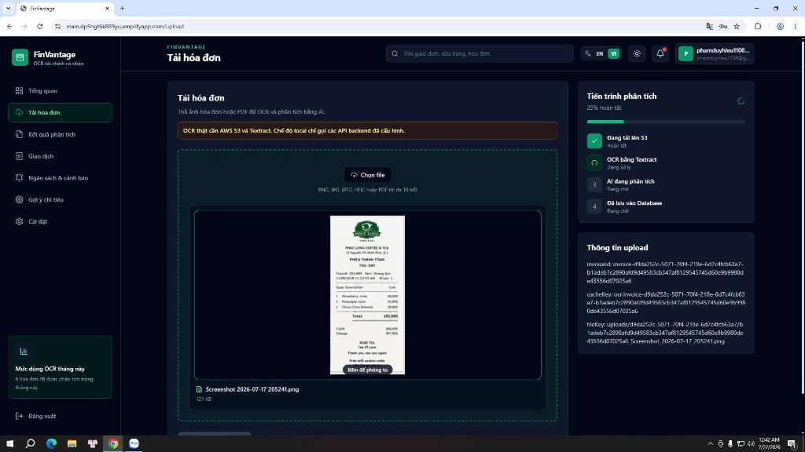

---
title: "Amazon SQS và Worker Lambda"
date: 2026-07-20
weight: 4
chapter: false
pre: " <b> 5.5.4. </b> "
---

### Amazon SQS và Worker Lambda (Kiến trúc đề xuất mở rộng)

> ⚠️ **LƯU Ý QUAN TRỌNG:**  
> **Thành phần mở rộng/đề xuất, chưa xác nhận đã được triển khai trong hệ thống production hiện tại.**  
> Để tối ưu hóa tài nguyên phát triển và chi phí vận hành ở giai đoạn chạy thử nghiệm, dự án FinVantage hiện tại đang chạy các luồng xử lý phân tích AI một cách đồng bộ trực tiếp thông qua lời gọi API từ Frontend. Phần cấu hình dưới đây được trình bày như một giải pháp thiết kế kiến trúc mở rộng giúp hệ thống nâng cao hiệu năng khi tải cao.

---

### Mục tiêu
Trang này sẽ giới thiệu cho các bạn giải pháp thiết kế kiến trúc **asynchronous processing (xử lý bất đồng bộ)** sử dụng **Amazon SQS** và **Worker Lambda** để tách biệt luồng xử lý nặng ra khỏi request chính của người dùng, giúp tối ưu hóa trải nghiệm sử dụng.

### Giới thiệu ngắn
Quá trình gọi Amazon Textract bóc tách ảnh và gửi text thô sang Amazon Bedrock suy luận ngôn ngữ có thể mất từ 3 đến 10 giây. Trong môi trường production lớn, nếu bắt người dùng đứng chờ phản hồi API đồng bộ quá lâu, giao diện sẽ dễ bị đơ hoặc lỗi timeout (quá thời gian phản hồi). Giải pháp sử dụng hàng đợi là câu trả lời chuẩn xác nhất cho bài toán này.

### Vai trò của giải pháp hàng đợi trong kiến trúc đề xuất

*   **Amazon SQS (Simple Queue Service):** Đóng vai trò làm message queue (hàng đợi thông điệp) trung gian. Khi người dùng tải hóa đơn lên, backend Lambda chỉ cần lưu trữ siêu dữ liệu và đẩy một "Task" (chứa ID hóa đơn và địa chỉ file S3) vào SQS Queue, sau đó trả về ngay lập tức phản hồi `202 Accepted` cho Frontend. Người dùng sẽ thấy trạng thái `Analyzing` và có thể tiếp tục làm việc khác.
*   **Worker Lambda:** Hàm chạy ngầm được kích hoạt tự động bởi SQS. Worker Lambda sẽ thực hiện polling (truy vấn liên tục) để lấy tin nhắn từ SQS, sau đó thong thả thực thi chuỗi tác vụ nặng gồm: Gọi Textract OCR → gọi Bedrock phân tích → lưu PostgreSQL.
*   **Amazon SQS Dead Letter Queue (DLQ - hàng đợi tin nhắn lỗi):** Là hàng đợi phụ được cấu hình để hứng các tin nhắn bị xử lý lỗi nhiều lần (ví dụ: hóa đơn bị mờ, lỗi kết nối mạng). Nếu Worker Lambda xử lý lỗi một tin nhắn quá 3 lần (Retry Limit), tin nhắn đó sẽ được chuyển sang DLQ để quản trị viên kiểm tra thủ công, tránh gây tắc nghẽn hàng đợi chính.
*   **Visibility timeout (thời gian ẩn tin nhắn tạm thời):** Khoảng thời gian SQS tạm ẩn tin nhắn sau khi được một Worker Lambda lấy ra xử lý, ngăn chặn việc một Worker khác nhảy vào xử lý trùng lặp cùng một hóa đơn.

---

---

### Các lỗi thường gặp khi triển khai hệ thống hàng đợi bất đồng bộ
*   **Lỗi: `Hóa đơn bị xử lý trùng lặp (Duplicate processing)`**
    *   *Nguyên nhân:* Do thời gian xử lý thực tế của Textract + Bedrock vượt quá cấu hình **Visibility Timeout** của SQS, khiến SQS tưởng tin nhắn bị lỗi và hiển thị lại để Worker khác lấy ra xử lý.
    *   *Cách xử lý:* Tăng Visibility Timeout của SQS Queue lên tối thiểu bằng 6 lần thời gian chạy timeout của hàm Lambda (ví dụ set thành 5 phút).

### Kết luận ngắn
Mô hình hàng đợi bất đồng bộ SQS và DLQ là mảnh ghép hoàn hảo giúp FinVantage sẵn sàng scale-up (mở rộng quy mô) để đáp ứng hàng triệu người dùng đồng thời trong tương lai mà không lo sập hệ thống.
