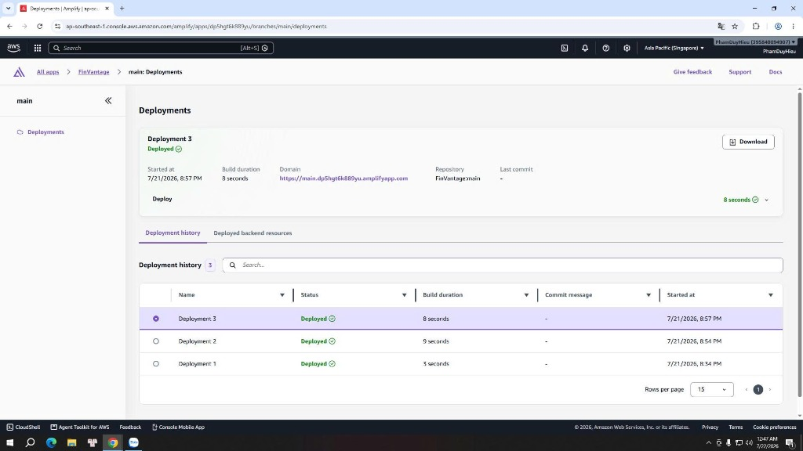
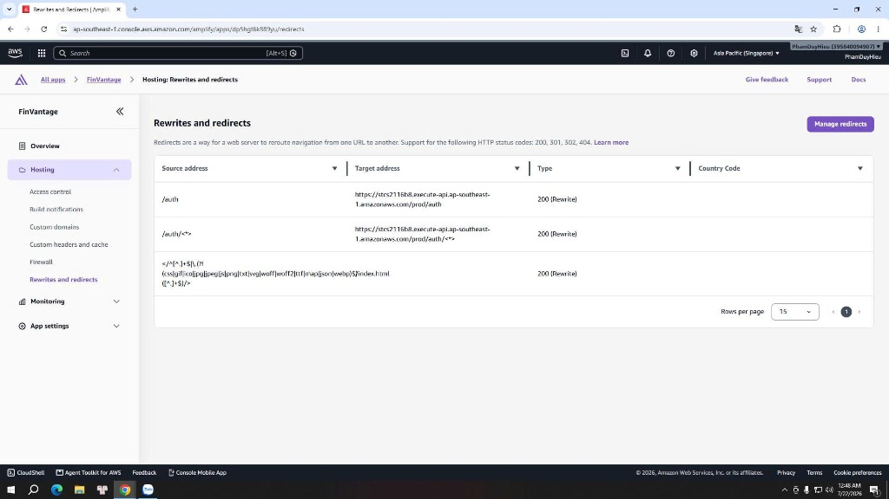

### AWS Amplify Hosting

### Mục tiêu
Trang này sẽ hướng dẫn các bạn cách đóng gói mã nguồn Frontend tĩnh React/Vite ở máy local, cấu hình biến môi trường build, thực hiện upload lên **AWS Amplify Hosting**, xác minh lịch sử deploy thành công và kiểm tra cấu hình định tuyến lại (Rewrites and redirects) của hệ thống **FinVantage**.

### Giới thiệu ngắn
AWS Amplify Hosting là dịch vụ hosting (lưu trữ) chuyên dụng cho các single page application (ứng dụng trang đơn - SPA). Amplify tự động kết nối mạng phân phối CDN CloudFront ở phía sau, quản lý chứng chỉ bảo mật HTTPS và cung cấp bộ định tuyến cấu hình URL linh hoạt.

### Vai trò của dịch vụ trong FinVantage
*   **Web Hosting:** Lưu trữ giao diện ứng dụng React/Vite cho người dùng truy cập trực tuyến qua Internet tại địa chỉ `https://main.dp5hgt6k889yu.amplifyapp.com`.
*   **SPA fallback (cơ chế định hướng lại trang cho ứng dụng trang đơn):** Hỗ trợ React Router định tuyến đường dẫn ảo. Khi người dùng truy cập vào các route con như `/invoices`, `/settings`, Amplify tự động redirect (chuyển hướng) về file gốc `/index.html` để mã JavaScript client-side tự xử lý giao diện mà không báo lỗi HTTP 404.
*   **Reverse proxy (máy chủ ủy quyền ngược):** Định tuyến các yêu cầu `/auth` an toàn về API Auth.

---

### Quy trình đóng gói và triển khai Frontend (Manual Deployment)

Trước khi upload code lên Amplify Hosting, chúng ta thực hiện build (đóng gói) ở máy local:

**Bước 1: Cấu hình biến môi trường build**
Mở mã nguồn Frontend trên VS Code, tạo file `.env` (hoặc cấu hình các biến môi trường trực tiếp trong quá trình build) chứa thông tin kết nối API Gateway:
```bash
VITE_API_BASE_URL=https://stcs2116b8.execute-api.ap-southeast-1.amazonaws.com/prod
VITE_AUTH_MODE=cognito
```
> ⚠️ **Lưu ý bảo mật:** Tuyệt đối không được đưa các mật khẩu hay thông tin đăng nhập nhạy cảm (như DB password, Cognito client secret key) vào các biến `VITE_*` này, vì khi compile (biên dịch mã nguồn), chúng sẽ bị đóng gói thẳng vào file Javascript chạy dưới trình duyệt của client và bất kỳ ai cũng có thể đọc trộm.

**Bước 2: Cài đặt và biên dịch dự án**
Chạy các lệnh sau trong terminal của thư mục frontend:
```bash
npm install
npm run build
```
Mã nguồn sau khi biên dịch xong sẽ nằm gọn trong thư mục `frontend/dist/`.

**Bước 3: Đóng gói tệp tin ZIP chuẩn**
*   Truy cập vào thư mục `dist/`.
*   Chọn toàn bộ nội dung bên trong thư mục này (bao gồm file `index.html`, `assets/`...) và tiến hành nén lại thành một tệp tin `.zip`.
*   > ⚠️ **Lưu ý quan trọng:** File `index.html` và thư mục `assets/` bắt buộc phải nằm ở ngay thư mục gốc (root) của file ZIP. Nếu bạn nén nguyên cả thư mục cha `dist/` vào, Amplify sẽ không thể đọc được cấu trúc web dẫn đến lỗi trắng trang hoặc HTTP 404.

**Bước 4: Deploy thủ công lên AWS Amplify**
Upload file ZIP vừa đóng gói lên giao diện quản lý ứng dụng `FinVantage` trên Amplify Console.

---

### Các bước kiểm tra cấu hình trên AWS Console

#### 1. Kiểm tra lịch sử Deploy của Frontend

**Bước 1:** Đăng nhập AWS Console → Tìm `Amplify` → Chọn dịch vụ **AWS Amplify**.

**Bước 2:** Click chọn ứng dụng **FinVantage** → Chọn branch **main** ở màn hình quản lý.

**Bước 3:** Kiểm tra và xác nhận:
*   **Deployment status:** Hiển thị trạng thái deploy thành công (`Succeed` hoặc `Successful`).
*   **Production URL:** Click vào liên kết dạng `https://main.dp5hgt6k889yu.amplifyapp.com` để mở giao diện web thực tế và xác nhận trang hoạt động bình thường, tải tài nguyên assets HTTP 200 đầy đủ.

---



---

#### 2. Kiểm tra cấu hình Rewrites and redirects (SPA Fallback & Proxy)

**Bước 1:** Tại thanh menu bên trái của ứng dụng FinVantage, click chọn **Rewrites and redirects** (nằm dưới mục App settings).

**Bước 2:** Xác minh các dòng quy tắc định tuyến lại có thứ tự logic chính xác như sau:
1.  **Source address:** `</auth>` & `</auth/<*>>` → **Target address:** API endpoint backend → **Type:** `200 (Rewrite)` để làm proxy kết nối API.
2.  **Source address:** `</**>` → **Target address:** `/index.html` → **Type:** `200 (Rewrite)` để làm SPA fallback.

*Lưu ý:* Quy tắc `/auth` bắt buộc phải được đặt **lên trên** quy tắc chung `</**>` để API Gateway nhận diện chính xác luồng xác thực trước khi các route ảo khác bị redirect về `index.html`.

---



---

### Kết luận ngắn
AWS Amplify Hosting đã triển khai thành công mã nguồn Frontend, đồng bộ hoàn chỉnh với API backend và cấu hình các quy tắc định hướng route ảo an toàn.

---

### Danh sách hình ảnh cần chụp cho báo cáo
1.  `finvantage-amplify-deployments.png` - Lịch sử deploy thành công của Frontend.
2.  `finvantage-amplify-redirects.png` - Cấu hình bảng Rewrites and redirects của Amplify.