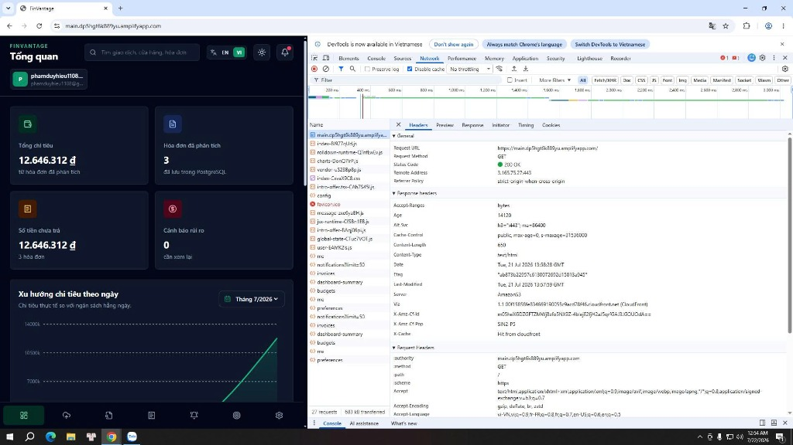

### Mạng phân phối nội dung CloudFront

### Mục tiêu
Trang này sẽ giải thích cơ chế phân phối bộ nhớ đệm CDN của **Amazon CloudFront** được tích hợp sẵn dưới AWS Amplify Hosting, hướng dẫn bạn cách sử dụng công cụ gỡ lỗi F12 Developer Tools trên trình duyệt để kiểm tra và xác minh CloudFront đang hoạt động thực tế cho hệ thống **FinVantage**.

### Giới thiệu ngắn
Amazon CloudFront là mạng lưới CDN (Content Delivery Network - mạng phân phối nội dung) toàn cầu của AWS. Đối với Frontend tĩnh của FinVantage, thay vì bắt trình duyệt của người dùng kết nối trực tiếp đến S3 để tải tệp tĩnh, CloudFront sẽ lưu trữ bản sao (cache) các tệp này tại hàng trăm edge location (điểm phân phối biên mạng toàn cầu) để người dùng tải trang tức thời.

### Vai trò của CloudFront trong AWS Amplify Hosting
*   **Triển khai tự động:** Khi deploy (triển khai) ứng dụng lên AWS Amplify Hosting, Amplify sẽ tự động thiết lập một CloudFront Distribution chạy ngầm phía sau. Bạn không cần phải tự tạo thủ công CloudFront Distribution, cấu hình Origin Access Control (OAC) hay cập nhật S3 Bucket Policy bằng tay. Việc này được AWS Amplify tự động quản lý hoàn toàn và đảm bảo an toàn.
*   **Hoạt động độc lập:** Nhờ có CloudFront CDN phân phối Frontend và API Gateway phân phối Backend, website FinVantage hoạt động trực tuyến 24/7. Cho dù bạn có tắt VS Code hay tắt hoàn toàn máy tính cá nhân local, website vẫn chạy bình thường trên Internet.
*   **Hard refresh (tải lại trang bỏ qua bộ nhớ đệm):** Khi bạn deploy phiên bản frontend mới lên Amplify, CloudFront đôi khi vẫn giữ lại cache cũ trên trình duyệt. Bạn cần sử dụng tổ hợp phím `Ctrl + F5` (hoặc `Cmd + Shift + R` trên macOS) để xóa cache cục bộ và nạp code mới nhất.

---

### Các bước kiểm tra CloudFront hoạt động bằng F12 Developer Tools

Vì CloudFront được quản lý ngầm bởi Amplify, chúng ta không cần vào AWS CloudFront Console để kiểm tra mà có thể xác minh trực tiếp bằng công cụ của trình duyệt:

**Bước 1:** Mở trình duyệt Web (Chrome, Edge hoặc Firefox) và truy cập vào đường dẫn production của ứng dụng: `https://main.dp5hgt6k889yu.amplifyapp.com`.

**Bước 2:** Nhấn phím **`F12`** (hoặc click chuột phải chọn **Inspect** / Kiểm tra) để mở công cụ **Developer Tools**.

**Bước 3:** Chuyển sang tab **Network** (Mạng) → Reload (tải lại) trang web.

**Bước 4:** Click chọn request tải trang chính hoặc các file asset tĩnh (ví dụ: file `index.html` hoặc file Javascript/CSS trong thư mục `assets/`):
*   Quan sát bảng **Response Headers** (tiêu đề phản hồi từ máy chủ) ở bên phải.
*   Xác minh sự hiện diện của trường **`via`** hiển thị giá trị chứa cụm từ: `1.1 <mã-edge-location>.cloudfront.net (CloudFront)`.
*   Xác minh trường **`x-cache`** hiển thị trạng thái `Hit from cloudfront` (tải từ cache biên thành công) hoặc `Miss from cloudfront` (lần đầu tải và đang nạp cache).

---

---

### Các lỗi thường gặp và cách xử lý
*   **Lỗi: `Giao diện web không cập nhật sau khi deploy bản mới`**
    *   *Nguyên nhân:* Do cache của CloudFront CDN chưa hết hạn hoặc trình duyệt local của bạn còn lưu cache cũ.
    *   *Cách xử lý:* Thực hiện hard refresh trên trình duyệt (Ctrl + F5) hoặc xóa lịch sử duyệt web để ép buộc trình duyệt tải lại các file assets mới từ CloudFront.

### Kết luận ngắn
Mạng lưới phân phối CloudFront CDN tích hợp dưới AWS Amplify đã hoạt động chính xác, đảm bảo tốc độ tải trang tối ưu cho ứng dụng FinVantage.

---

### Danh sách hình ảnh cần chụp cho báo cáo
1.  `finvantage-cloudfront-header.png` - Response Headers chứa thông tin CloudFront trong F12 Network tab.