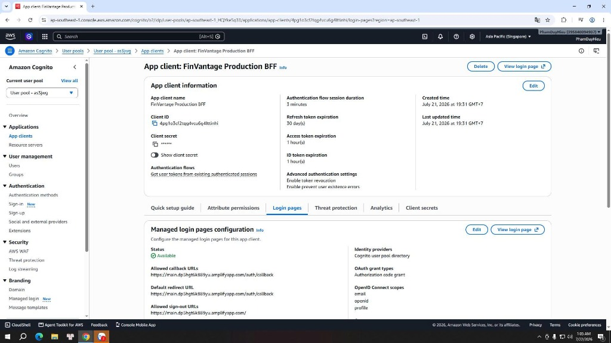
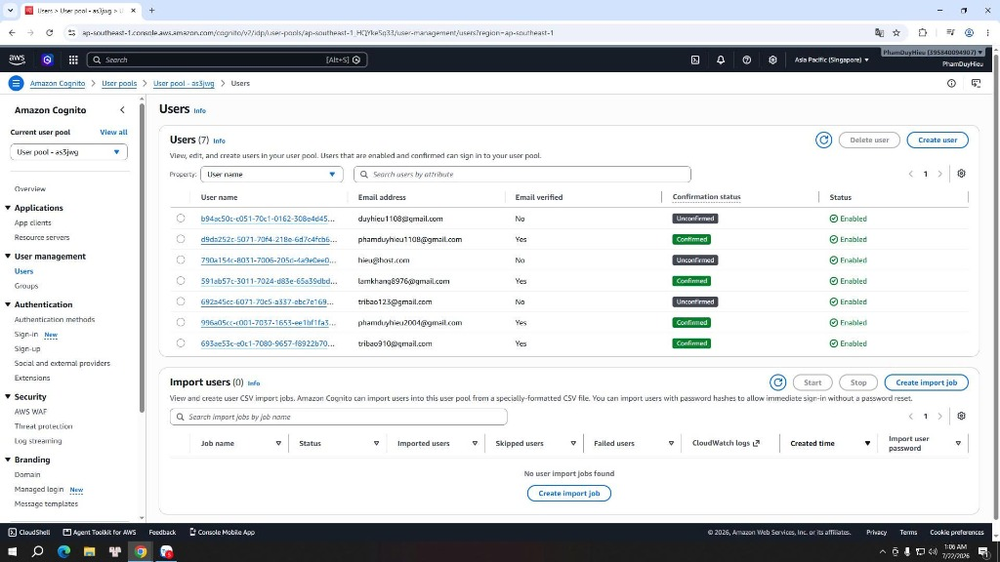

### Amazon Cognito User Pool

### Mục tiêu
Trang này sẽ hướng dẫn các bạn cách truy cập **Amazon Cognito Console** để xác minh User Pool ID **`ap-southeast-1_HQYkeSq33`**, kiểm tra các cấu hình App client (Client ID), thiết lập Hosted UI (giao diện đăng nhập được AWS lưu trữ sẵn), kiểm tra các đường dẫn Callback URLs thực tế và quản lý danh sách người dùng đã đăng ký của hệ thống **FinVantage**.

### Giới thiệu ngắn
Amazon Cognito cung cấp giải pháp quản lý danh tính, xác thực và phân quyền người dùng an toàn. FinVantage sử dụng Cognito làm Identity provider (dịch vụ quản lý định danh người dùng) để quản lý luồng đăng nhập, cấp phát JWT token (mã thông báo định dạng chuỗi JSON) chứng thực cho Frontend gửi request lên API backend.

### Các thông số cấu hình thực tế của FinVantage

*   **User Pool ID:** `ap-southeast-1_HQYkeSq33` (đặt tại Singapore Region).
*   **App client (ứng dụng khách kết nối) settings:**
    *   **Client ID:** `<LẤY GIÁ TRỊ THỰC TẾ TỪ AWS CONSOLE>` (chuỗi ký tự ngẫu nhiên dùng định danh frontend React).
    *   **Client Secret:** Đã được thiết lập lưu trữ an toàn để xác thực cookie/session ở Lambda backend.
*   **Hosted UI configuration:**
    *   **Allowed callback URLs (Các đường dẫn chuyển hướng phản hồi đăng nhập):**
        *   Production: `https://main.dp5hgt6k889yu.amplifyapp.com/auth/callback`
        *   Local test: `http://localhost:5173/auth/callback`
    *   **Allowed sign-out URLs (Các đường dẫn chuyển hướng sau khi đăng xuất):**
        *   Production: `https://main.dp5hgt6k889yu.amplifyapp.com`
        *   Local test: `http://localhost:5173`
    *   **OAuth 2.0 Grant Types:** `Authorization code grant` (phương thức cấp quyền mã xác thực - cơ chế trao đổi mã lấy token bảo mật nhất).
    *   **OAuth 2.0 Scopes:** `openid`, `email`, `profile`.

---

### Các bước kiểm tra cấu hình trên AWS Console

#### 1. Kiểm tra User Pool và App Client Settings

**Bước 1:** Đăng nhập AWS Console → Tìm `Cognito` → Chọn dịch vụ **Amazon Cognito**.

**Bước 2:** Tại giao diện quản lý User pools, tìm và click chọn dòng ID: **`ap-southeast-1_HQYkeSq33`**.

**Bước 3:** Chuyển sang tab **App integration** (Tích hợp ứng dụng) → Cuộn xuống mục **App clients and analytics**:
*   Xác nhận sự tồn tại của App client liên kết với Frontend. Copy và ghi lại mã **Client ID** của dự án.
*   Click chọn vào tên app client này để xem chi tiết cấu hình Hosted UI.

**Bước 4:** Tại phần **Hosted UI settings**, click chọn **Edit** (nếu cần xem đầy đủ) để xác minh các thông số **Callback URLs** và **Sign-out URLs** có được thiết lập chính xác như mô tả ở trên hay chưa.

---

---

#### 2. Quản lý và kiểm tra danh sách tài khoản người dùng

**Bước 1:** Tại trang chi tiết User pool, click chọn tab **Users** (Người dùng).

**Bước 2:** Xác minh danh sách toàn bộ các tài khoản người dùng đã đăng ký thành công trên hệ thống. 
*   Trạng thái **Status** hiển thị là `Confirmed` (Xác thực thành công).
*   **Trigger gửi OTP:** Khi người dùng mới đăng ký, Cognito sẽ tự động gửi mã OTP xác nhận về địa chỉ email của người dùng trước khi chuyển trạng thái thành Confirmed.

---

---

> ⚠️ **Lưu ý bảo mật cực kỳ quan trọng:** Khi chụp ảnh màn hình danh sách người dùng cho báo cáo học tập, bắt buộc phải sử dụng công cụ bôi mờ (blur) hoặc che (cắt) bớt ký tự email cá nhân của người dùng để bảo mật thông tin cá nhân (ví dụ hiển thị dạng `hieu***@gmail.com`).

### Kết luận ngắn
Amazon Cognito User Pool đã hoạt động ổn định, thực hiện cấp phát JWT token an toàn, hỗ trợ giao diện đăng nhập Hosted UI chuẩn hóa và quản lý người dùng tập trung hiệu quả.

---

### Danh sách hình ảnh cần chụp cho báo cáo
1.  `finvantage-cognito-config.png` - Cấu hình Hosted UI, Client ID và Callback URLs của Cognito.
2.  `finvantage-cognito-users.png` - Danh sách Users đăng ký thành công trên Cognito (đã bôi mờ email bảo mật).