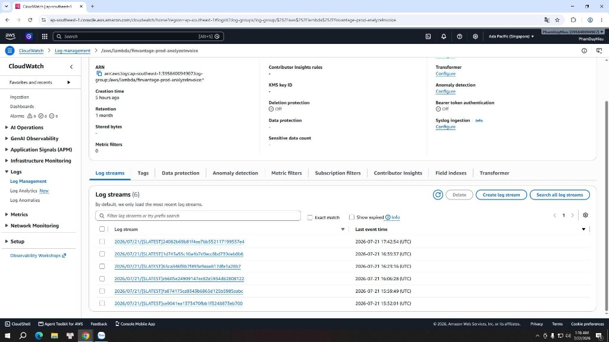
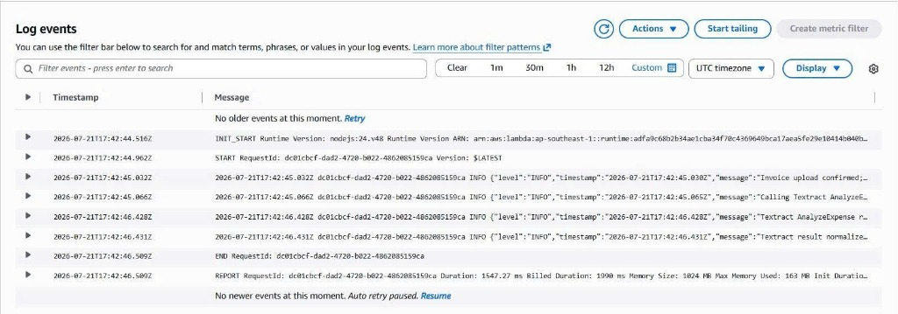

### Amazon CloudWatch

### Mục tiêu
Trang này sẽ hướng dẫn các bạn cách truy cập **Amazon CloudWatch Console** để kiểm tra log chi tiết trong Log Groups của các hàm Lambda backend, cách tìm kiếm và phân tích lỗi, đồng thời hướng dẫn xây dựng bảng điều khiển giám sát **CloudWatch Dashboard** cho toàn bộ hệ thống **FinVantage**.

### Giới thiệu ngắn
Amazon CloudWatch là dịch vụ giám sát và quản lý tài nguyên tập trung của AWS. Đối với hệ thống Serverless như FinVantage, tất cả các lệnh in log (`console.log()` hoặc `console.error()`) của các hàm Lambda backend Node.js 24 đều được tự động gom và lưu trữ bảo mật dưới CloudWatch Logs.

---

### Các bước thực hành trên AWS Console

#### 1. Kiểm tra nhật ký thực thi (CloudWatch Logs)

**Bước 1:** Đăng nhập AWS Console → Tìm kiếm `CloudWatch` → Chọn dịch vụ **CloudWatch**.

**Bước 2:** Tại menu bên trái, click chọn mục **Logs** → Chọn **Log groups**.

**Bước 3:** Tại thanh tìm kiếm Log groups, nhập tên hàm Lambda backend của dự án (ví dụ: `/aws/lambda/finvantage-prod-analyzeInvoice`). Click chọn Log group đó.

**Bước 4:** Tại danh sách **Log streams** (dòng nhật ký chi tiết), xác minh các Log stream được tạo tương ứng với các phiên chạy của Lambda.

---

---

**Bước 5:** Click chọn dòng nhật ký mới nhất (gần nhất với thời gian bạn kích hoạt upload hóa đơn trên Frontend).
*   Xem và phân tích nội dung log: Xác nhận luồng chạy từ việc kết nối database PostgreSQL thông qua RDS Proxy, kết nối Valkey/Redis, kết quả lấy text từ S3, lệnh AssumeRole, và kết quả JSON trả về từ Amazon Bedrock.

---

---

#### 2. Xây dựng và kiểm tra CloudWatch Dashboard

Chúng ta thiết lập một Dashboard tập trung giúp theo dõi sức khỏe phần cứng và tần suất cuộc gọi của toàn bộ ứng dụng FinVantage trên một giao diện duy nhất.

**Bước 1:** Tại menu bên trái CloudWatch Console, click chọn mục **Dashboards** → Click chọn **Create dashboard**.

**Bước 2:** Đặt tên Dashboard là `finvantage-prod-dashboard` (hoặc tương tự) → Click **Create**.

**Bước 3:** Thêm các widgets (các ô cửa sổ hiển thị đồ họa biểu đồ) quan trọng cho Dashboard:
*   **Widget 1: Lambda Invocations (Số lượng cuộc gọi)**
    *   *Loại:* Stacked area hoặc Number widget.
    *   *Metric:* `AWS/Lambda` > `Invocations` (Chọn các hàm core của dự án như `importInvoice`, `ocrInvoice`, `analyzeInvoice`).
*   **Widget 2: Lambda Execution Duration (Thời gian chạy trung bình)**
    *   *Loại:* Line chart widget.
    *   *Metric:* `AWS/Lambda` > `Duration` (Giúp theo dõi độ trễ khi gọi AI).
*   **Widget 3: API Gateway Requests & Errors**
    *   *Loại:* Line chart widget.
    *   *Metric:* `AWS/ApiGateway` > `Count` (Số lượng request) và `5XXError` (Tỷ lệ lỗi server).
*   **Widget 4: RDS & Cache CPU Utilization (Hiệu suất CPU)**
    *   *Loại:* Line chart widget.
    *   *Metric:* `AWS/RDS` > `CPUUtilization` và `AWS/ElastiCache` > `CPUUtilization` (Để giám sát tải của Database/Cache).

**Bước 4:** Click **Save dashboard** để lưu lại cấu hình.

---

> 📸 HÌNH CẦN THÊM  
> Chụp màn hình: AWS Console → CloudWatch → Dashboards → Chọn `finvantage-prod-dashboard` vừa tạo.  
> Nội dung cần thấy: Giao diện Dashboard hiển thị đầy đủ các biểu đồ biểu diễn metrics Invocations, Duration của Lambda, số lượng API requests, và tải CPU của database.  
> Tên ảnh đề xuất: `finvantage-cloudwatch-dashboard.png`  
> Chú thích: “Hình 5.7.1b. Giao diện bảng điều khiển trung tâm CloudWatch Dashboard giám sát hệ thống FinVantage.”

---

> ⚠️ **Lưu ý bảo mật cực kỳ quan trọng:** Khi chụp ảnh màn hình các trang giao diện AWS Console để làm báo cáo, bạn nên sử dụng công cụ bôi mờ (blur) hoặc cắt bớt mã **AWS Account ID** (nằm ở góc trên bên phải màn hình console) để đảm bảo an toàn thông tin tài khoản của bạn.

### Các lỗi thường gặp và cách xử lý
*   **Lỗi: `Không tìm thấy Log stream trong Log group của Lambda`**
    *   *Nguyên nhân:* Hàm Lambda chưa từng được kích hoạt hoặc IAM execution role của Lambda bị thiếu quyền `logs:CreateLogStream` và `logs:PutLogEvents`.
    *   *Cách xử lý:* Kiểm tra lại quyền của Lambda IAM Role, đảm bảo có chứa policy ghi logs CloudWatch, và thực hiện gọi API từ web để kích hoạt Lambda chạy lần đầu.

### Kết luận ngắn
Hệ thống Amazon CloudWatch đã được thiết lập ghi nhật ký và chỉ số đầy đủ, giúp quản trị viên dễ dàng nắm bắt trạng thái hệ thống FinVantage theo thời gian thực.

---

### Danh sách hình ảnh cần chụp cho báo cáo
1.  `finvantage-cloudwatch-logs.png` - Chi tiết log stream chạy thành công của backend Lambda.
2.  `finvantage-cloudwatch-dashboard.png` - Các biểu đồ chỉ số hiệu năng trên CloudWatch Dashboard.