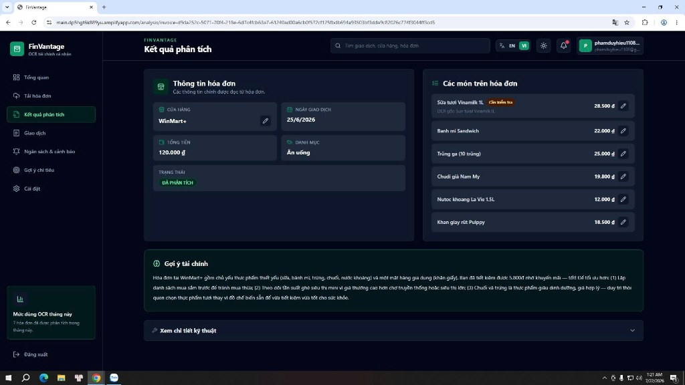
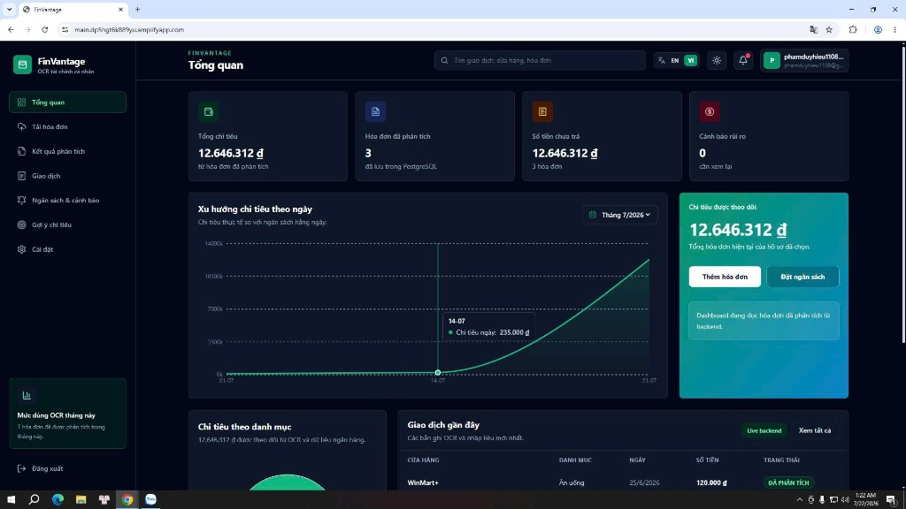

### Kiểm thử thực tế và Đánh giá kiến trúc

### Mục tiêu
Trang này sẽ hướng dẫn các bạn thực hiện một kịch bản kiểm thử end-to-end (từ đầu đến cuối) hoàn chỉnh trên hệ thống **FinVantage** đang chạy thực tế: từ đăng nhập qua Cognito Hosted UI, upload hóa đơn, Textract OCR bóc tách chữ, Bedrock AI phân tích phân loại, đến kiểm tra kết quả lưu trữ trên PostgreSQL và hiển thị Dashboard chi tiêu.

---

### Kịch bản kiểm thử thực tế (Live Demo)

**Bước 1: Truy cập ứng dụng và đăng nhập**
*   Mở trình duyệt web, truy cập vào địa chỉ: `https://main.dp5hgt6k889yu.amplifyapp.com`.
*   Click nút **Đăng nhập**. Hệ thống sẽ chuyển hướng sang giao diện **Cognito Hosted UI** (trang đăng nhập được AWS lưu trữ sẵn).
*   Nhập tài khoản email và mật khẩu đã đăng ký → Đăng nhập thành công → Trình duyệt được redirect (chuyển hướng) về trang chủ Dashboard của FinVantage.

**Bước 2: Upload hóa đơn thực tế**
*   Click vào chức năng **Import hóa đơn** (hoặc nút Upload).
*   Chọn một bức ảnh hóa đơn thực tế từ máy tính (ví dụ: hóa đơn siêu thị, quán cà phê, vé xe, hóa đơn điện nước).
*   Hệ thống nhận metadata, sinh presigned URL (đường dẫn tải lên có chữ ký bảo mật tạm thời) và upload ảnh lên S3.
*   Giao diện hiển thị trạng thái `Uploading...` → `Processing OCR...`.

**Bước 3: Quan sát quá trình xử lý AI**
*   Ở hậu trường, chuỗi xử lý tự động diễn ra:
    1.  Ảnh hóa đơn vào S3 bucket `finvantage-invoices-hieu-2026-395840094907` → S3 Event kích hoạt Lambda `ocrInvoice`.
    2.  Lambda `ocrInvoice` gọi Amazon Textract API `AnalyzeExpense` bóc tách text thô → Kết quả được cache vào Valkey/Redis.
    3.  Lambda `analyzeInvoice` đọc text từ Redis → AssumeRole sang tài khoản Bedrock → Gọi Claude 3.5 Sonnet phân tích và phân loại danh mục chi tiêu → Kết quả JSON lưu vào PostgreSQL qua RDS Proxy.
*   Giao diện cập nhật trạng thái `Analyzed` khi hoàn tất.

**Bước 4: Kiểm tra kết quả trên giao diện**
*   Mở trang chi tiết hóa đơn vừa import → Xác minh các trường thông tin đã được AI phân tích chính xác: Tên nhà cung cấp (Vendor), Tổng tiền (Total), Ngày giao dịch (Date), Danh mục chi tiêu (Category) và Lời khuyên tài chính từ AI (AI Advice).
*   Quay lại trang **Dashboard** → Xác minh biểu đồ chi tiêu đã cập nhật số liệu mới.

---

---

---

### Bài học kinh nghiệm và Đánh giá kiến trúc (Reflection)

Quá trình triển khai kiến trúc Serverless kết hợp AI đã mang lại những bài học kỹ thuật quý giá:

*   **Cold Start và VPC (Khởi động lạnh trong mạng nội bộ):** Các hàm Lambda chạy trong VPC Private Subnets ban đầu sẽ mất thêm vài giây để khởi tạo kết nối mạng (ENI - Elastic Network Interface). Giải pháp: Sử dụng ElastiCache Valkey/Redis làm bộ đệm trạng thái tốc độ cao giúp giảm thiểu số lần kết nối nặng vào database PostgreSQL.
*   **RDS Proxy - Bộ đệm kết nối không thể thiếu:** Kết nối trực tiếp từ Lambda vào PostgreSQL khi có bùng nổ traffic sẽ dẫn đến cạn kiệt connection pool và crash database. RDS Proxy đóng vai trò multiplex (chia sẻ ghép kênh) kết nối, đảm bảo hệ thống ổn định ở mọi tải.
*   **Cross-account Bedrock - Quản lý AI tập trung:** Thiết kế gọi Bedrock chéo tài khoản qua `sts:AssumeRole` giúp tách biệt tài nguyên AI khỏi tài khoản chạy hạ tầng, dễ dàng quản lý chi phí AI và phân quyền bảo mật đúng nguyên tắc Least Privilege (quyền tối thiểu cần thiết).
*   **Textract AnalyzeExpense vs AnalyzeDocument:** Sử dụng API chuyên biệt `AnalyzeExpense` cho kết quả bóc tách hóa đơn chính xác hơn rất nhiều so với API đa mục đích `AnalyzeDocument` thông thường, nhờ được AWS huấn luyện riêng cho cấu trúc hóa đơn/biên lai.
*   **Amplify Hosting + Rewrites:** Cấu hình Rewrites and Redirects trên Amplify để reverse proxy `/auth` về API Gateway là kỹ thuật then chốt để Cognito Hosted UI hoạt động chính xác mà không cần custom domain phức tạp.

### Kết luận ngắn
Hệ thống FinVantage đã hoạt động end-to-end hoàn chỉnh: Từ đăng nhập bảo mật, upload hóa đơn, bóc tách AI tự động đến hiển thị Dashboard chi tiêu trực quan. Kiến trúc Serverless kết hợp AI đã chứng minh khả năng co giãn, tiết kiệm chi phí và tự động hóa xử lý nghiệp vụ hiệu quả.

---

### Danh sách hình ảnh cần chụp cho báo cáo
1.  `finvantage-live-demo-result.png` - Kết quả hóa đơn đã được AI phân tích trên giao diện.
2.  `finvantage-dashboard-summary.png` - Dashboard tổng hợp chi tiêu hiển thị biểu đồ.